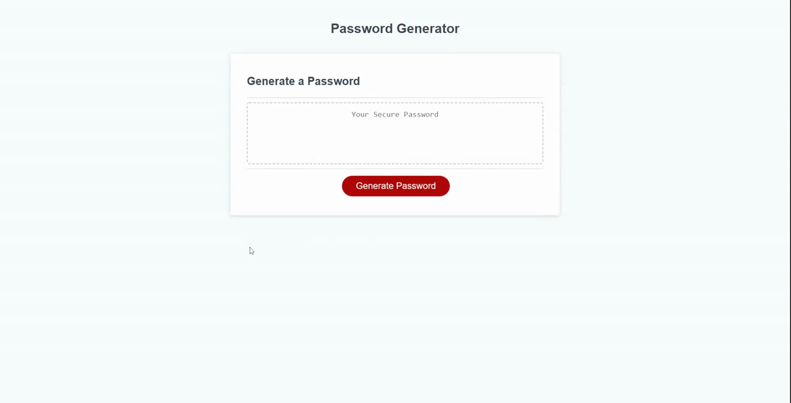

# Password Generator

This password generator consists of three kinds of code: HTML, CSS, and JavaScript; it can be found at the link below:

https://totoero.github.io/Module3_Assignment/Develop/

The password generator pulls characters at random from a character bank that is generated as users answer prompts on how they want to configure it. The user has the ability to define the length of the password, and choose whether or not the password will have:
- Uppercase letters
- Lowercase letters
- Numbers
- Symbols

After providing their choices, a character bank is generated with the characters they would like. An if loop randomly selects chracters from this pool and concatenates them one by one until the final password string meets the user-specified length.

 

