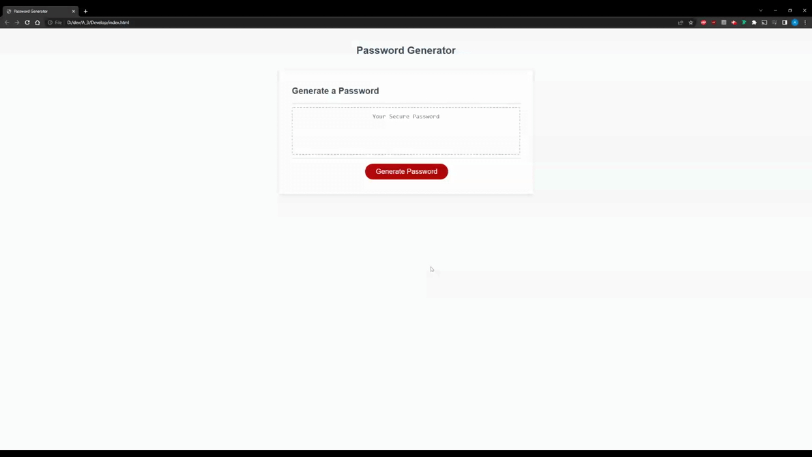

# Password Generator

This password generator consists of three kinds of code: HTML, CSS, and JScript.

The password generator pulls characters at random from a character bank, which is then concatenated one by one to the final password string. The math.floor(math.random * length) function is key to achieving this as it returns a random integer between 0 and the length of the character bank, enabling the charAt() method to select from any of the characters randomly. The for loop iterates 15 times to create a password that is 15 characters long. 

 

